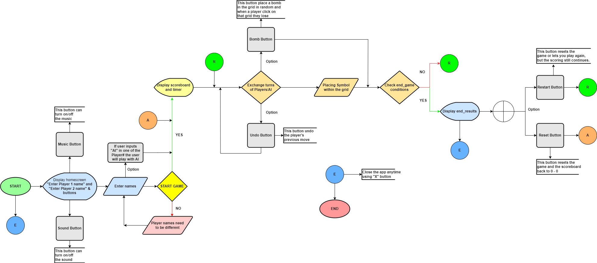

# Tic-Tac-BOOM! 💣 (FINAL PACK)

## 📌 ABOUT THE REPOSITORY

We are Group 5 - Tech 5avvies from BSIT 1-5 of Polytechnic University of the Philippines. This repository houses all the code and assets required to build, run, and maintain our application. **Tic-Tac-Boom,** is a classic 3x3 game wherein it can be won by filling a row, column, or diagonal with the same symbol (X or O).  

## 🚀 ADDITIONAL FINAL FEATURES

• **UNDO** Feature - The player may undo their move in case they misplaced their turn in the wrong box.  
• **BOMB** Feature - The player may randomly place a bomb in one of the boxes, and if the other player clicks on it, they will lose the game.  
• **SOUND EFFECT** Feature - The players may turn on/off the music on their end for increased immersion in the game.  
• **BACKGROUND** - Background or the UI was enhanced to make the game visually appealing and make the players feel like they are inside the game world.  

---

## 🔶 FLOWCHART

---

## 💻 TECHNOLOGIES USED

• Programming Language(s): **Python**  
• Tools: **PyCharm** and **Visual Studio Code**  
• Additional: **Lucidchart**

Python was used for developing the app, while PyCharm and VS Code served as the Integrated Development Environment (IDEs) for writing, running, and debugging the Python code. Lucidchart was also integrated for creating the flowchart to visualise the app’s process and logic clearly.

---

## 🙋‍♀️ AUTHORS

**Martina Chloe Ablanida**  
Information Technology Student  

**Jericho Lawrence Pandeagua**  
Information Technology Student  

